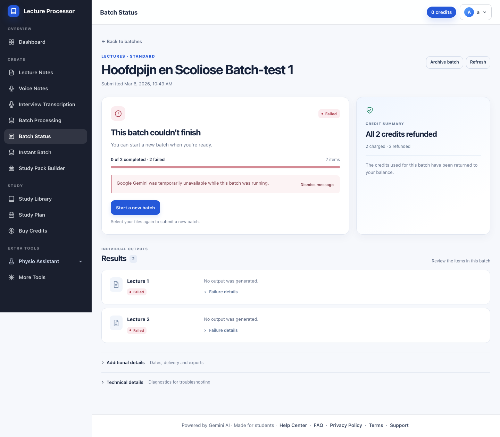
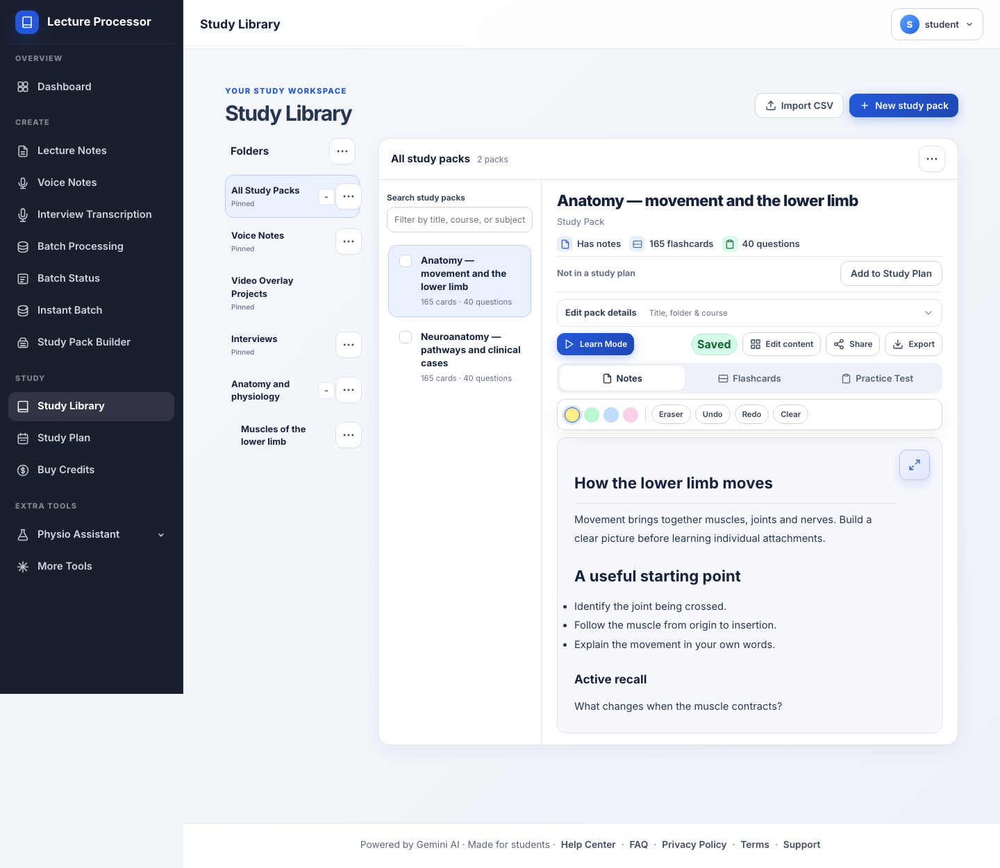
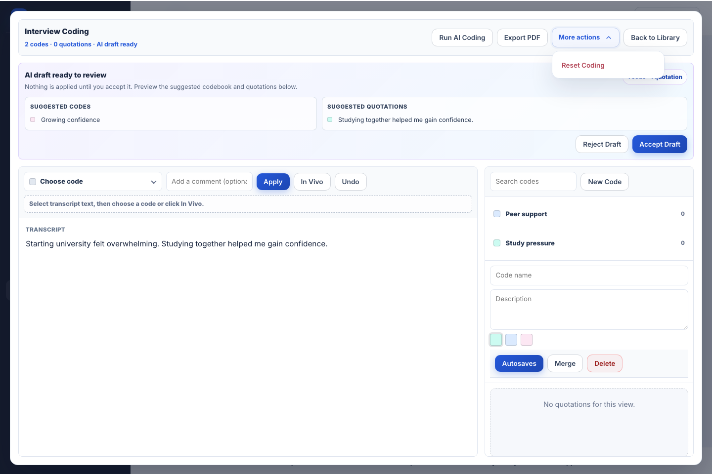
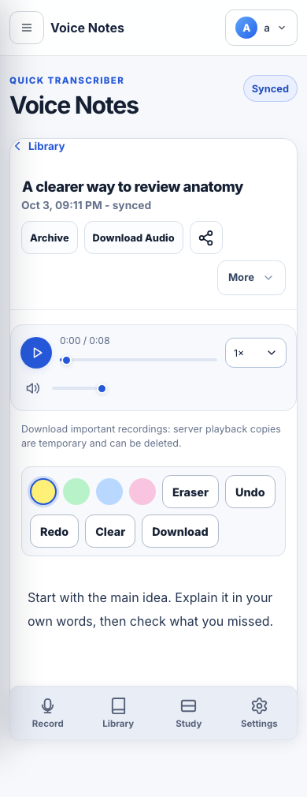

# Redesign reference captures

Rendered from the isolated local preview with synthetic fixtures. These are representative desktop captures, not production account data. Full route/state verification is recorded in the adjacent visual redesign reports.

## Batch Status

The failed-batch state now groups its outcome, refund receipt, next action and individual results, with technical details behind disclosures.

## Study Library

Compact folders and pack navigation frame a readable material workspace, with primary study actions above the content.

## Product menus

The former browser-default More disclosure is now a custom trigger and anchored action panel, with matching opening and closing motion, keyboard navigation and focus return.

## Website media controls

Stored Voice Notes audio uses the same rounded controls, custom speed selector and restrained surfaces on mobile. The synthetic recording was played, paused and checked in the actual detail view.

